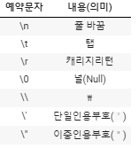
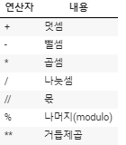
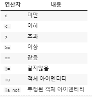
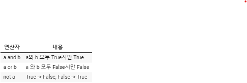

# 1. Python

## 주석

- 한줄 주석은 # 로 표현
- 여러줄은 ''' '''혹은 """ """ 으로 표현하며 멀티라인으로 쓸 경우 주로 함수 클래스 설명 할때 활용


## 변수

- 할당 연산자
  - 변수는 =을 통해 할당
  - 해당 데이터 타입을 확인할때는 type()
  - 해당 값의 메모리 주소를 확인할때는 id()
- 식별자(identifiers)
  - 파이썬에서 식별자는 변수,함수,모듈,클래스 등을 식별하는데 사용되는 이름입니다.
    - 식별자의 이름은 영문 알파벳, 밑줄,숫자로 구성
    - 첫 글자에 숫자가 올 수 없다.
    - 길이에 제한이 없다.
    - 대소문자를 구별한다.
    - 아래의 예약어는 사용 할 수 없다.

```python
False, None, True, and, as, assert, break, class, continue, def, del, elif, else, except, finally, for, from, global, if, import, in, is, lambda, nonlocal, not, or, pass, raise, return, try, while, with, yield
```

## 데이터 타입


- 숫자(number)타입

  - int(정수)- 모든 정수는 int로 표현한다.

  - float(실수) -실수는 float 로 표현하며, 실수를 컴퓨터가 표현하는 과정에서 부동소수점으로 사용되며,

    항상 같은 값으로 일치되지 않습니다. (ex  - 컴퓨터식 지수 표현 : `b = 314e-2` `print(b)`  답: 3.14)

  - complex(복소수) -각각 실수로 표현되는 실수부와 허수부를 가진다. 복수수는 허수부를 j로 표현한다.

- 글자(string)타입

  - 따옴표 사용-  문자열 안에 문장부호(',"')가 사용 될 경우 이스케이프 문자(\)를 활용 가능합니다.

  - 이스케이프 시퀀스- 특수 문자 조작법

    

  - string interpolation

    - %-formatting   ex-( `print('내이름은 %s 입니다.' % name)`  결과값:내이름은 ashley 입니다.)
    - str.format()      ex-(`print('내이름은 {} 입니다.'.format(name))` 결과값:내이름은 ashley 입니다.) 
    - f-strings            ex-(`print(f'내이름은 {name} 입니다.')`) 결과값:내이름은 ashley 입니다.

- 참/거짓(Boolean)타입

  - 파이썬에는 True와 False로 이뤄진 bool타입이 있습니다.

    비교/논리 연산을 수행 등에서 활용됩니다.

    다음은 False로 변환됩니다.

    `0, 0.0, (), [], {}, '', None`

  ##  연산자

  - 산술 연산자

    

  - 비교 연산자

  

  - 논리 연산자

    			

  

  - 복합 연산자

  